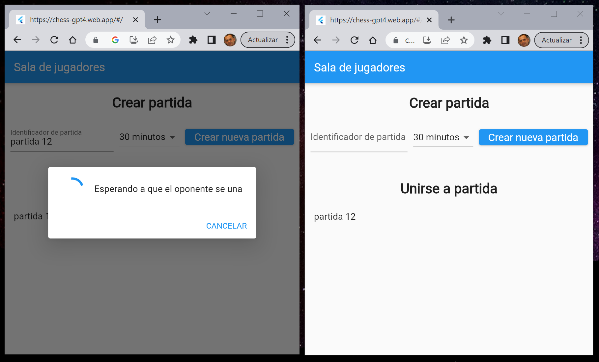
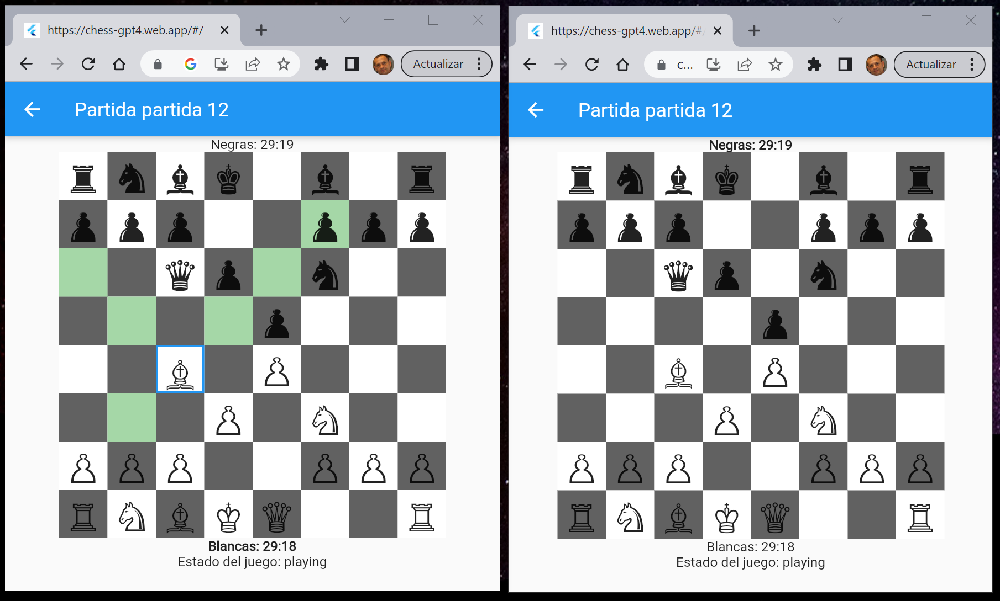

# Chess GPT-4 - Ajedrez online en Flutter generado con GPT-4.

Permite a dos jugadores jugar al ajedrez de forma online.
Se ha creado para comprobar si GPT-4 es capaz de generar un juego de ajedrez,
usando istrucciones en lenguaje natural.

## Para jugar

Abre el link [https://chess-gpt4.web.app/](https://chess-gpt4.web.app/) en dos navegadores. 
Puede ser en un mismo ordenador o en dos ordenadores diferentes.
En un orederador, crea una partida y en el otro, unete a la partida.
El primero en hacer un novimiento jugará con blancas.

## Características implementadas

- [x] sala de jugadores, para crear y unirse a partidas.
- [x] cronómetro para controlar el tiempo de cada jugador.
- [x] se marcan las casillas a las que puede ir la pieza seleccionada.
- [x] fin de partida por fin del tiempo.

## Características no implementadas

- [x] no se detectan jaques.
- [x] no se detectan jaques mates.
- [x] no se detectan tablas.
- [x] no se permite el enroque.
- [x] no se permite el peón al paso.
- [x] no se permite la promoción del peón.

## Instrucciones solicitadas a GPT-4

Podrías hacer un widget en fluter que pintara un tablero de ajedrez?

Podrías añadir las fichas en la posición inicial?

En la última fila has puesto fichas blancas, ¿Pudes arreglarlo?

Pero si no has cambiado nada.

El método toLowerCase() no funciona para cambiar el color de la ficha. Prueba sin usarlo

Podrías hacer una clase en Dart con nombre Tablero. El estado estaría formado por una matriz de 8x8 caracters donde estarían las fichas en representación Unicode y el turno. Ha de tener un método para mover una ficha, pero solo si el movimiento es válido.

Podrías añadir el // TODO: Agregar validaciones específicas para cada tipo de ficha

Quiero que se puedan mover las fichas con el ratón

Dada la clase Tablero quiero que cambies el método _isValidMove para que no tenga el parámetro piece.  Además ha de tener en cuenta que los peones pueden comer en diagonal.

Puedes modificar _isValidMove para que las piezas no puedan saltar a otras, con excepción del caballo.

Modifica la clase Tablero para que una pieza no pueda comer otra de su mismo color

Modifica el siguiente widget, para que en lugar de utilizar DragTarget se comporte de la siguiente forma. Primero se pulsará sobre la pieza a mover, luego se resaltarán las posiciones donde se puede mover la pieza finalmente se pulsará sobre la posición a la que se desea mover la pieza.

Modifica el método isValidMove() para que solo permita mover un ficha banca si _whiteTurn = true y negra en caso contrario.
bool _whiteTurn = true;

Dada la siguiente clase, modifícala para que se pueda jugar online. Cada vez que un jugador mueva una ficha registrará su movimiento utilizando Firebase realtime database. Luego esperará a que el otro jugador escriba su jugada en la misma base de datos.

En mi proyecto de Flutter ya tengo instalado Firebase realtime database e inicializado en main. Quiero que modifique el siguiente widget para jugar al ajedrez por turnos online. En el código habrá una constante con nombre first=true para el primer jugador. El segundo tendrá el valor a false.
El primer jugador indicará la pieza a mover, indicando la coordenada origen y la coordenada destino. Esta jugada se codificará con un String de 4 caracteres, los 2 primeros la coordenada origen y los siguientes la destino. Para cada coordenada se indicará la columna con una letra de la ‘A’ a la ‘H’ y la fila con un dígito del ‘1’ al ‘8’.
Una vez que el primer jugador introduzca la coordenada. Se llamará a bool moverFicha(int fromRow, int fromCol, int toRow, int toCol) de la clase Tablero, para verificar si es una jugada correcta y mover la ficha. Si la tirada es correcta se almacenará en realtime database, en una lista de jugadas. Entonces el segundo jugador, que está ejecutando su código en otro ordenador detectará esta escritura y llamará al mismo método para mover la ficha. luego se esperará a que el usuario introduzca una nueva jugada y la guardará igualmente en real time data base. ahora volverá a ser el turno del jugador primero.

Añade un contador de movimientos y úsalo para generar el cuando se guarda un nuevo movimiento, en el siguiente código. Actualiza la línea if ((firstPlayer && event.snapshot.key!.length % 2 == 1)… Aquí tienes el código original:

Modifica las líneas:
databaseRef.child('moves').push().set(move);
_moveCounter++; // Increment move counter after a valid move
Para que en lugar de crearse una key basada en marca temporal, se use como key _moveCounter. Además quiero que la primera clave sea 1.

Dado el código mostrado al final. Modifícalo para que cuando un jugador reciba una tirada con contador igual a 1 la variable first player pase a false. Además solo el jugador con first player a true podrá mover las fichas blancas y si first player es false solo podrá mover las fichas negras.

Crea un widget que que tenga un formulario con los siguientes campos.
Un texto: “Crear nueva partida” Un cuadro de texto indicar el identificador de partida y un botón con texto “crear partida”.
Más abajo una nueva sección con texto “Unirse a partida creada”. Tras el cual se mostrarán todos los nodos de Firebase Realtime database que cuelgan de “/chess_open”.
Cuando se pulsa en “crear partida” se verifica que el cuadro de texto no está vacío y qué el texto introducido no es nodo de /chess_open ni de /chess_game. Tras esto se creará un nuevo nodo con este texto que cuelgue de /chess_open. Luego se quedará esperando hasta que otro usuario escriba en /chess_open un nodo con key =”confim” y valor =”OK”. Tras lo cual se abrirá el widget ChessBoard pasándole coo parámetro el identificador de partida.
Cuando se pulse en un elemento de la lista de unirse a una partida se obtendrá el identificador de partida y se escribirá en el nodo /chess_open/id_partida  un nodo con key =”confim” y valor =”OK”. Tras lo cual se abrirá el widget ChessBoard pasándole coo parámetro el identificador de partida.

Modifica la clase que añado al final, para que ya no utilice el nodo ‘chess_open’. En su lugar se almacenará todo en ‘chess_game’. Se utilizará en campo ‘state’, que podrá tomarlos valores: open, confirm, playing y game over.
Para mostrar las partidas abiertas has de buscar en los nodos chess_game/$gameId para los que state=open.
Cuando el jugador que abre la partida mostrará una ventana emergente con texto ‘Esperando oponente’ y esperará hasta que verifica que el campo state = confirm, pondrá state en playing, antes de empezar a jugar.
El jugador que selecciona una partida en la lista ha de mostrar una ventana emergente con texto ‘Comprobando que el oponente sigue conectado’ y esperará hasta que verifica que el campo state = playing.
El jugador que selecciona una partida en la lista ha de mostrar una ventana emergente con texto ‘Comprobando que el oponente sigue conectado’ y esperará hasta que verifica que el campo state = playing.
Añade el botón CANCELAR para que el usuario pueda dejar de esperar.
Añade separación entre el circulo que gira y el texto.

Te voy a pasar unos apuntes de una asignatura universitaria para que crees un examen de respuesta múltiple.
Quiero jugar a un juego contigo. Tenemos 10 cartas con números del 0 al 9. Vas a repartir 5 cartas a cada uno al azar. Indicarás a cada uno la carta que tiene. Empiezas a jugar tu. Juegas una carta, y luego yo otra. Si tu carta es mayor ganas tú, y si la mía es mas grande gano yo. El que gana empieza en la siguiente ronda. Se retiran las dos cartas y se sigue jugando. En total habrán 5 rondas, gana el juego el que más rondas haya ganado.

Modifica el siguiente código para que “Crear nueva partida” y “Unirse a la partida” aparezcan más grande, centrado y con separación por arriba.
Identificador de partida y el botón Crear partida ha de estar en la misma fila.
Entre los dos añade un desplegable, con nombre tiempo por jugador, con los valores numéricos seleccionables 5, 10, 15, 20, 25, 30, 40, 50 y 60. Por defecto 30.

Dada la clase ChessBoard, quiero que añadas un contador de tiempo de juego para cada contador. El valor inicial será maxTimePlayer. El tiempo restante de las negras se mostrará en la parte superior y el de las blancas en la inferior. Cuando las blancas hagan el primer movimiento, el contador de las negras empezará a descontar. Cuando lo haga las negras su contador se detendrá y empezará a contar el de las blancas.

Dada la clase ChessBoard, quiero que subrayes el texto Negras: si el jugador juega con las negras y Blancas: en caso contrario.

Podrías cambiarlo para que el texto este subrayado en lugar de cambiar de color?

Puedes conseguir que solo el jugador que juega con las blancas pueda mover estas fichas y viceversa.  Cuando _moveCounter es 0, los dos podrán mover las blancas

En el método  build() muestra al final el valor ChessGame.state
